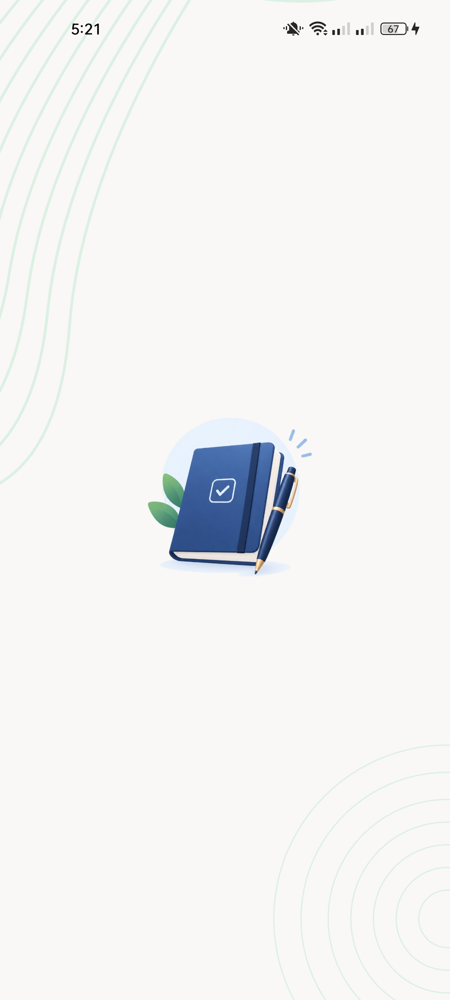
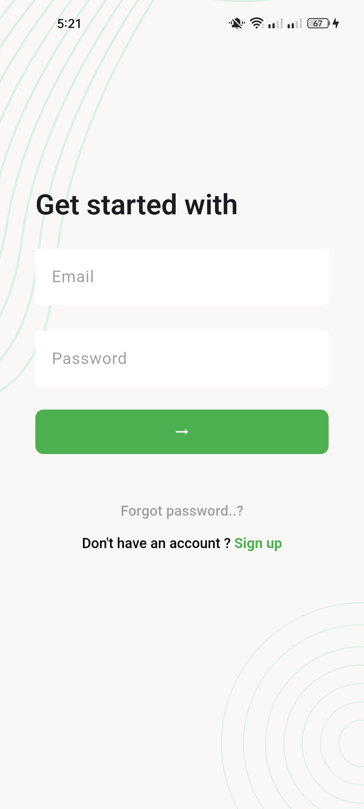
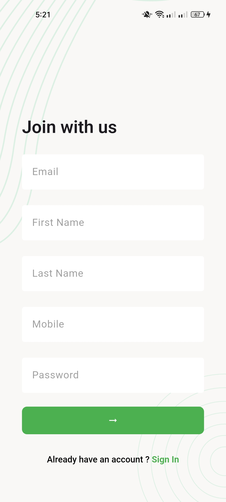
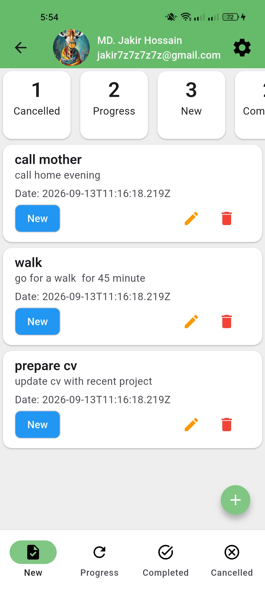
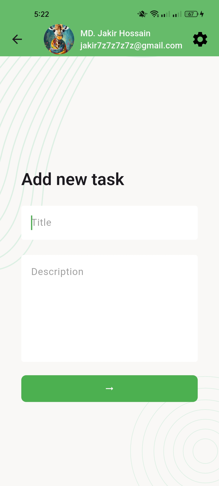
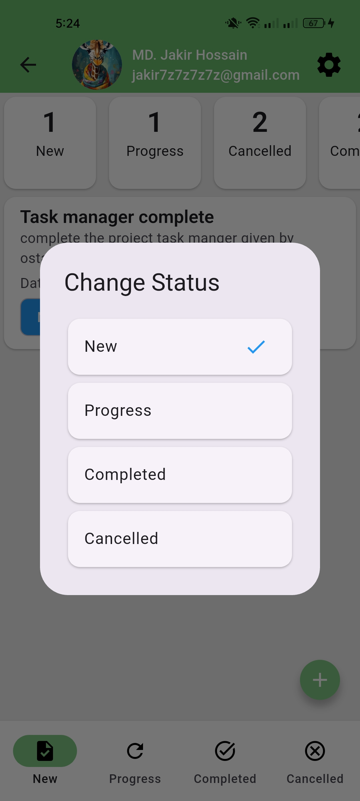
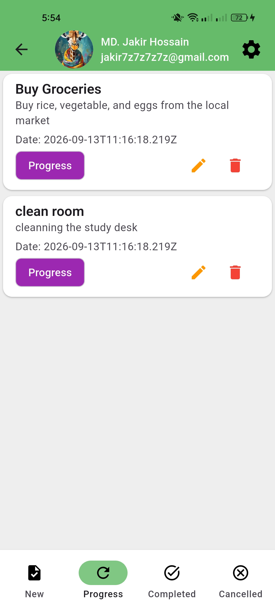
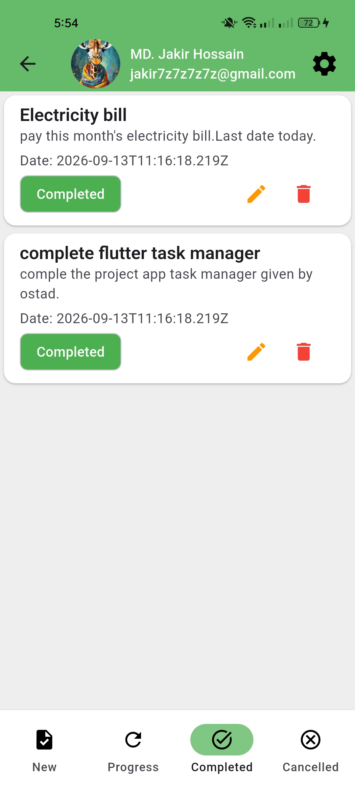
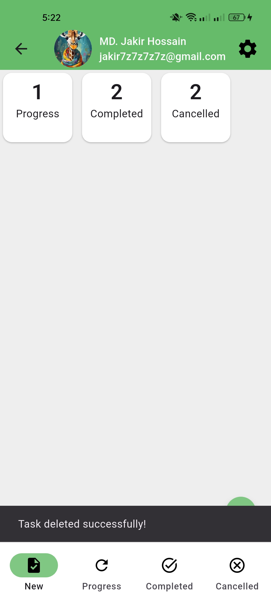
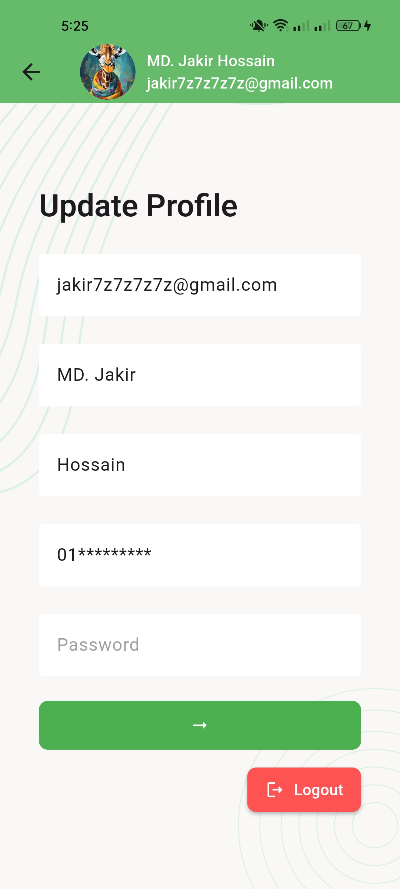

# Task Manager App

A complete Flutter Task Manager application developed as part of an
Ostad assignment.

The app allows users to manage their daily tasks through a simple and
user-friendly interface. Users can create, update, delete, and change
the status of tasks, as well as manage their profile information and
authentication.

## Features

-   User Registration
-   User Login
-   User Authentication
-   Task Dashboard
-   Task Status Count
-   Create New Task
-   Update Task
-   Delete Task
-   Change Task Status
-   New, Progress, Completed and Cancelled task lists
-   Profile Update
-   Forgot Password / OTP Flow
-   Loading, Success and Error Handling
-   REST API Integration

## Technologies Used

-   Flutter
-   Dart
-   REST API
-   HTTP
-   Provider
-   Shared Preferences

## Task Status

-   **New** --- Newly created tasks
-   **Progress** --- Tasks currently being worked on
-   **Completed** --- Finished tasks
-   **Cancelled** --- Cancelled tasks

## API Integration

The application integrates REST APIs for user authentication, task
creation, task listing by status, task status updates, task updates,
task deletion, profile updates, and password recovery.

## Screenshots

### Splash Screen

### Login Screen

### Sign Up Screen

### New Tasks

### Add Task

### Task Status Change

### Progress Tasks

### Completed Tasks

### Cancelled Tasks

### Task Delete

### Profile Update

## Password Recovery Note

The password recovery flow has been implemented according to the
provided API collection. The recovery email endpoint currently returns
an HTTP 404 response from the deployed backend.

## Assignment

This project was completed as part of the **Ostad Task Manager App
assignment**.
